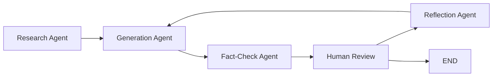

#  Multi-Agent Medium Article Generator

A sophisticated AI-powered system that generates high-quality Medium articles using multiple specialized agents with human oversight.

## 🌟 Features

- **🔍 Research Agent**: Real-time web research using Tavily Search API
- **✍️ Generation Agent**: Article creation with Google Gemini 2.0-flash
- **✅ Fact-Check Agent**: Accuracy verification and misinformation detection
- **👤 Human Review**: Interactive feedback and approval system
- **🤔 Reflection Agent**: AI critique and improvement suggestions
- **📱 Web Interface**: Clean Streamlit UI with real-time progress tracking

## 🏗️ Architecture



## 🚀 Quick Start

### Prerequisites
- Python 3.13+
- Google Gemini API key
- Tavily Search API key

### Installation

1. **Navigate to the project:**
   ```bash
   cd /teamspace/studios/this_studio/buildables/week5_project/project
   ```

2. **Install dependencies:**
   ```bash
   uv sync
   ```

3. **Set up environment variables:**
   Ensure your `.env` file contains:
   ```
   GOOGLE_API_KEY=your_gemini_api_key
   TAVILY_API_KEY=your_tavily_api_key
   ```

4. **Run the application:**
   ```bash
   streamlit run app.py
   ```

5. **Open your browser:**
   Navigate to `http://localhost:8501`

## 📁 Project Structure

```
project/
├── app.py                    # Main Streamlit application
├── reflection_agent.py       # LangGraph workflow orchestration
├── reflection_chains.py      # LLM prompt definitions
├── workflow_backend.py       # Backend API for UI integration
├── pyproject.toml           # Dependencies and configuration
├── .env                     # API keys (not in git)
├── README.md               # This documentation
└── uv.lock                 # Dependency lock file
```

## 🔧 Core Components

### **Multi-Agent System**
- **Research Agent**: Uses Tavily Search to gather current, factual information
- **Generation Agent**: Creates engaging Medium articles using Gemini 2.0-flash
- **Fact-Check Agent**: Verifies claims and identifies potential misinformation
- **Human Review Agent**: Pauses workflow for manual feedback and approval
- **Reflection Agent**: Provides detailed critique and improvement suggestions

### **Technology Stack**
- **LangGraph 0.6.7**: Multi-agent workflow orchestration
- **LangChain 0.3.27**: LLM integration framework
- **Google Gemini 2.0-flash**: Primary language model for all agents
- **Tavily Search**: Real-time web research capabilities
- **Streamlit 1.28.0**: Modern web interface framework
- **Python 3.13**: Latest Python runtime with uv package manager

## 🎯 Usage

1. **Enter Topic**: Provide a Medium article topic or select from example topics
2. **Watch Progress**: Monitor the multi-agent workflow in real-time
3. **Review Content**: View research findings, generated article, and fact-check results
4. **Provide Feedback**: Give human input when the workflow pauses for review
5. **Get Final Article**: Download or copy the completed, refined article

## 🔄 Workflow Process

The system follows a sophisticated iterative improvement process:

1. **🔍 Research**: Gathers current information on the topic using Tavily Search
2. **✍️ Generate**: Creates initial article draft using Gemini 2.0-flash
3. **✅ Fact-Check**: Verifies accuracy and identifies potential issues
4. **👤 Human Review**: Pauses for manual feedback and approval
5. **🤔 Reflect**: AI analyzes feedback and suggests specific improvements
6. **🔄 Iterate**: Repeats generation with improvements (up to 12 messages total)

## ⚙️ Configuration

### **Customizing Agent Behavior**
Edit `reflection_chains.py` to modify prompts:
- `generation_prompt`: Controls article generation style and tone
- `reflection_prompt`: Defines critique criteria and improvement focus
- `research_prompt`: Shapes research scope and depth
- `fact_check_prompt`: Sets verification standards and accuracy checks

### **Workflow Parameters**
Modify `reflection_agent.py` for workflow adjustments:
- Message limits (currently 12 to prevent infinite loops)
- Agent routing logic and decision points
- Error handling and recovery behavior

### **UI Customization**
Update `app.py` for interface changes:
- Example topics and suggestions
- Feedback options and categories
- Progress indicators and status displays

## 🔍 Troubleshooting

### **Common Issues**

1. **API Key Errors**
   ```bash
   # Check your .env file
   cat .env
   # Ensure valid API keys and proper formatting
   ```

2. **Import/Dependency Errors**
   ```bash
   # Reinstall dependencies
   uv sync
   # Verify Python version
   python --version  # Should be 3.13+
   ```

3. **Streamlit Issues**
   ```bash
   # Clear cache and restart
   streamlit cache clear
   streamlit run app.py
   ```

### **Debug Mode**
Run the backend directly for debugging:
```bash
python reflection_agent.py
```

This will show the LangGraph workflow diagram and run a test article generation.

## 📊 Performance Metrics

- **Average Generation Time**: 2-3 minutes per complete article
- **Research Sources**: Up to 3 high-quality web sources per topic
- **Article Length**: Typically 800-1500 words (Medium-optimized)
- **Accuracy**: Enhanced through fact-checking and human oversight
- **Iteration Capability**: Up to 6 revision cycles based on feedback

## 🛡️ Best Practices

### **For Best Results**
- Use specific, focused topics rather than broad subjects
- Provide detailed feedback during human review phases
- Review fact-check results carefully for accuracy
- Consider your target audience when providing feedback

### **API Usage**
- Monitor your Gemini API usage for cost management
- Tavily Search has daily limits on free tier
- Consider implementing rate limiting for production use

## 🤝 Contributing

1. Fork the repository
2. Create a feature branch (`git checkout -b feature/amazing-feature`)
3. Make your changes and test thoroughly
4. Commit your changes (`git commit -m 'Add amazing feature'`)
5. Push to the branch (`git push origin feature/amazing-feature`)
6. Open a Pull Request

## 📄 License

This project is for educational and demonstration purposes. Please ensure compliance with API terms of service when using in production.

##  Acknowledgments

- **LangGraph Team**: For the powerful multi-agent framework
- **Google**: For Gemini 2.0-flash API and excellent LLM capabilities
- **Tavily**: For real-time search and research capabilities
- **Streamlit**: For the intuitive web interface framework
- **LangChain**: For LLM integration and orchestration tools

---

**Built with ❤️ using cutting-edge multi-agent AI workflows**

*Ready to transform your content creation process? Start generating professional Medium articles in minutes!*